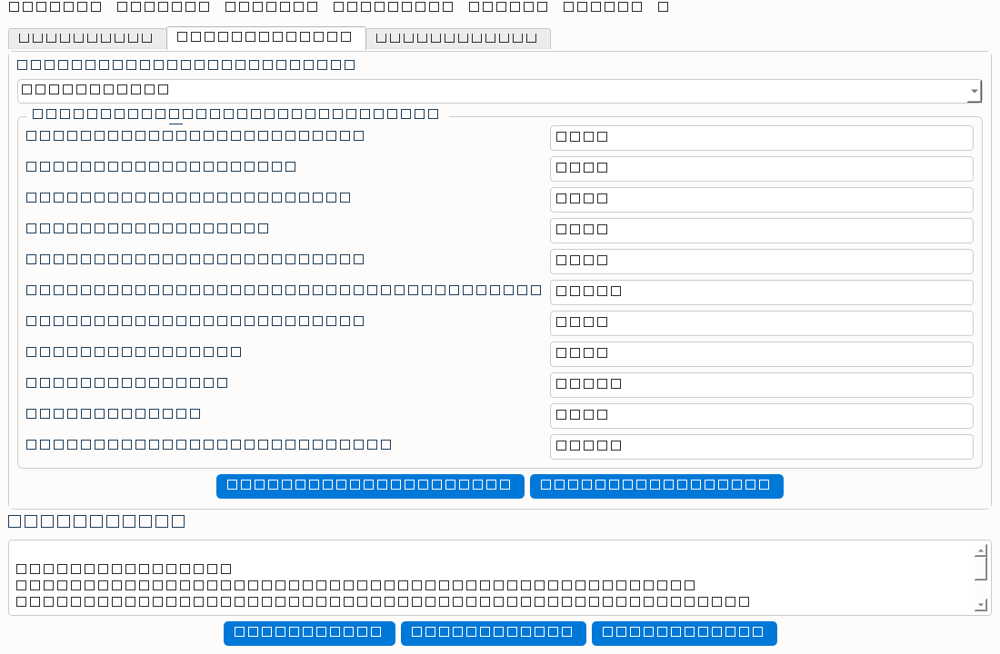
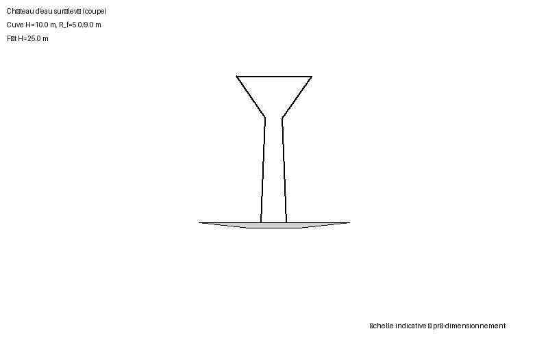
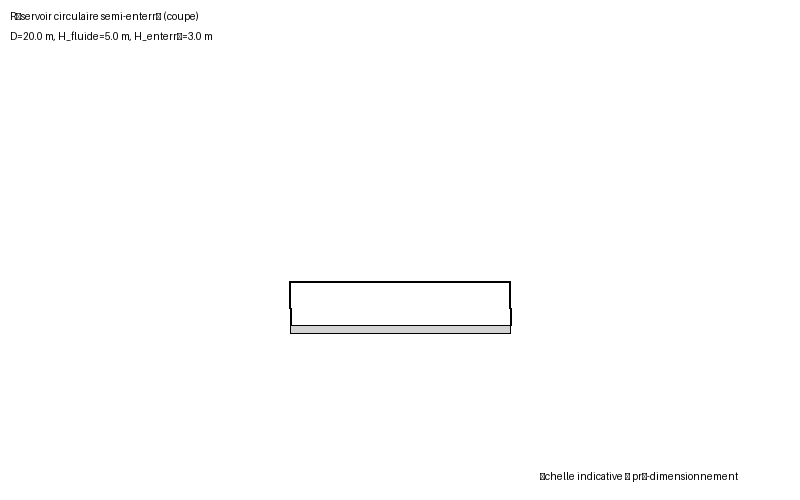
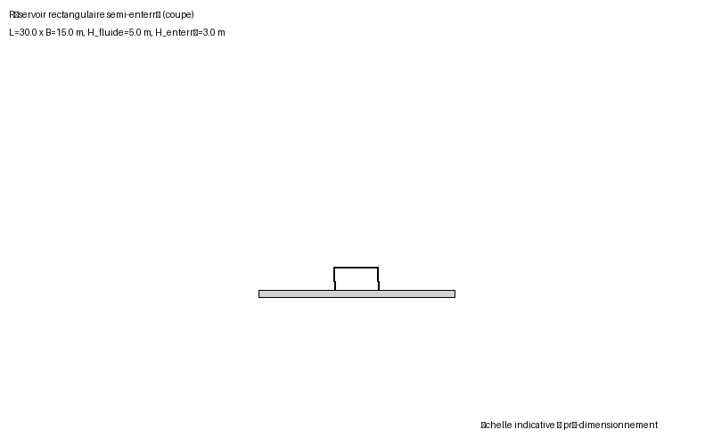

# MK_AnalyseSismiqueUnifiée_Pro

Application de bureau (Python + PySide6) pour l'**analyse sismique**, le
**dimensionnement** et le **ferraillage** des structures civiles contenant des
liquides (châteaux d'eau surélevés, réservoirs circulaires et rectangulaires
semi-enterrés / enterrés), selon la **méthode de Housner** (modèle à deux
masses) couplée aux règlements **RPS 2011 (Maroc)** et **Eurocode 8 (EC8)**.

> Outil « pro_expert » : exactitude des méthodes d'ingénierie, pas d'ajout de
> nouvelle réglementation sismique. Les vérifications sont documentées et
> traçables (note de calcul PDF / DOCX / CSV).

---

## Capture d'écran



*Interface à onglets (Entrées → Fondations → Armatures) avec les paramètres
sismiques et les résultats combinés.*

---

## Méthodes de calcul

### 1. Liquide — modèle de Housner (modèle à deux masses)
Référence : Housner G.W., *Dynamic Pressures on Fluid Containers*, 1963.

Pour chaque géométrie (cuve conique, cylindrique, rectangulaire) on décompose
le liquide en :
- **masse impulsive** `m_i` (suivre le mouvement du réservoir, hauteur `h_i`),
- **masse convective** `m_c` (oscillation propre du liquide, période `T_c`,
  hauteur `h_c`).

Les forces sismiques sont `F_i = m_i·Sa(T_i)` et `F_c = m_c·Sa(T_c)` avec le
spectre de calcul du règlement (`Sa` = accélération spectrale, facteur de
comportement `q`, classe de sol).

### 2. Poussée des terres — Mononobe–Okabe (réservoirs enterrés / semi-enterrés)
Pour la partie enterrée (`H_enterre`), la poussée active sismique utilise le
**coefficient de Mononobe–Okabe** :

```
Ka = cos²(φ − ψ − β)
      ───────────────────────────────────────────────────────────────
      cos ψ · cos² β · cos(δ + β + ψ)
      · ( 1 + √[ sin(δ+φ−ψ)·sin(φ−β−ψ) / ( sin(δ+β+ψ)·sin(φ−β) ) ] )²
```

avec `ψ = atan(kh/(1−kv))` (inclinaison sismique), `φ` frottement du sol,
`δ` frottement mural (`δ ≈ 0,66·φ`), `β` talus du remblai. La composante
horizontale retenue est `Pa·cos(δ+ψ)`. La poussée **augmente** avec le séisme
(par rapport au cas statique Coulomb / Rankine).

### 3. Combinaisons de calcul (cas usuels)
La fondation et le ferraillage sont évalués pour **les deux cas**, le plus
défavorable gouvernant :

| Ouvrage | CAS VIDE | CAS PLEIN |
|---|---|---|
| Réservoir enterré / semi-enterré | structure seule + poussée des terres (Rankine + **Mononobe–Okabe**) + séisme | structure + eau (hydrostatique + hydrodynamique **Housner**) + terres (MO) + séisme |
| Château d'eau surélevé | structure seule + séisme (pas d'eau, pas de terre) | structure + eau (**Housner**) + séisme |

### 4. Fondation — radier général
Radier circulaire / tronconique (châteaux et réservoirs circulaires) ou
rectangulaire / carré (réservoirs rectangulaires). Vérifications pour **chaque
combinaison** :
- contrainte de contact `σmax ≤ q_adm` et absence de décollement `σmin ≥ 0` ;
- excentricité `e ≤ noyau` (D/8 circulaire, B/6 rectangulaire) ;
- glissement (`FS ≥ 1,5`) et renversement (`FS ≥ 1,5`) ;
- **poinçonnement** (EC2 §6.4) pour les charges concentrées (châteaux) — l'
  auto-dimensionnement ajuste `h_f` jusqu'à conformité.

**Auto-dimensionnement** : itère jusqu'à `σmax ≤ q_adm` **et** `e ≤ noyau`,
pour toutes les combinaisons (pire cas).

### 5. Ferraillage (armatures)
Norme **couplée** au règlement sismique : **BAEL 91** si RPS 2011,
**Eurocode 2** si EC8.
- **Fissuration** (ouverture `w_k`, EC2 7.3.4 / Fasc. 74) **uniquement pour les
  éléments en contact avec l'eau** : radier de réservoir, parois/coque de cuve,
  ceintures (pariétales + anneaux de liaison), coupole inf.
- **FP/FPP max (ELU–ELA), sans fissuration**, pour les éléments hors eau :
  radier de château (sous la tour), fût/tour, coupole sup, dalle de couverture.
- **Coupoles** (sup/inf, Fasc. 74 : flèche `≥ D/10` et `≥ d/8`) et **ceintures**
  (anneau cuve↔coupole sup, anneau fût↔cuve↔coupole inf) : géométrie et
  épaisseurs saisies dès la 1ʳᵉ page pour que leur poids alimente le
  dimensionnement de la fondation.

### 6. Exports
Note de calcul **PDF**, **DOCX** (avec croquis de coupe) et **CSV**.

---

## Croquis de coupe (pré-dimensionnement)

| Château d'eau | Réservoir circulaire | Réservoir rectangulaire |
|---|---|---|
|  |  |  |

*Échelle indicative — représentation géométrique, pas un plan d'exécution.*

---

## Chaîne de validation

```
Entrées (géométrie + sismique)
        │
        ▼
Analyse sismique ──▶ Housner (liquide) + Mononobe–Okabe (terres)
        │            Combinaisons VIDE / PLEIN
        ▼
Onglet Fondations ──▶ radier (σ, noyau, glissement, renversement, poinçonnement)
        │  (conforme sur TOUTES les combinaisons ?)
        ▼
Onglet Armatures ──▶ ferraillage radier + parois/coque + coupoles + ceintures
        │
        ▼
Export PDF / DOCX / CSV
```

---

## Structure du projet

```
core/
  results.py           Modèle de rapport structuré (Report / Item)
  reglements.py        RPS 2011 & EC8 + spectre de calcul (branches complètes)
  housner.py           Paramètres Housner (conique, cylindrique, rectangulaire)
  stability.py         Vérification glissement / renversement (paramétrable)
  analyse_structure.py Orchestration + Mononobe–Okabe + combinaisons VIDE/PLEIN
  foundation.py        Dimensionnement & vérification du radier (toutes combos)
  reinforcement.py     Calcul des armatures (BAEL 91 / EC2, fissuration)
gui/
  main_window.py       Interface à onglets (PySide6)
reporting/
  pdf_generator.py     Note de calcul PDF
  docx_generator.py    Note de calcul DOCX (+ croquis)
  sketch.py            Croquis de coupe (Pillow)
tests/
  test_analysis.py     Tests de non-régression (Housner, MO, combinaisons, fissuration)
```

---

## Références

- Housner G.W., *Dynamic pressures on fluid containers*, 1963.
- Mononobe N. & Okabe S., *Earth pressure during earthquakes*, 1929.
- RPS 2011 (Maroc), annexes sismiques.
- Eurocode 8 (EN 1998-1) et Eurocode 2 (EN 1992-1-1).
- BAEL 91 modifié (référence historique Maroc).
- Fascicule 74 (cuves en béton armé, règles de fissuration).

---

## Installation

```bash
python -m venv env
source env/bin/activate        # Windows : env\Scripts\activate
pip install -r requirements.txt
python main.py
```

## Tests

```bash
pytest tests/
```

---

## Feuille de route (prochaines mises à jour)

- [ ] **Spectres multi-appuis / interaction sol–structure** (ressort de sol sur
      fondation souple) pour les châteaux d'eau.
- [ ] **Vérification du fût** complète (compression + flexion + stabilité
      globale hors axe sismique).
- [ ] **Coupoles** : dimensionnement par éléments finis (coque) et non plus en
      membrane simplifiée ; saisie automatique de l'épaisseur minimale.
- [ ] **Réservoirs rectangulaire/circular enterrés** : poussée des terres sur
      les 4 parois + angle de friction variable par couche de sol.
- [ ] **Fissuration** selon la méthode générale EC2 (section fictive, aciers
      passifs + éventuels précontraints).
- [ ] **Rapport d'armatures** : plan de calepinage (sciage des barres,
      rectangles de chaînage) en sortie DXF/SVG.
- [ ] **Internationalisation** : bascule FR/EN/AR de l'interface et des notes.
- [ ] **GitHub Actions CI** : exécution automatique de `pytest` à chaque push.
- [ ] **Exécutable** distribuable (PyInstaller) Windows/Linux/macOS.
- [ ] **Sauvegarde / chargement** des projets (fichier `.mkpro`) et comparaison
      de scénarios.

### Menu de l'application (à créer plus tard)
- [ ] **Menu Fichier** : Nouveau / Ouvrir projet (.mkpro) / Enregistrer /
      Enregistrer sous / Exporter la note (PDF, DOCX, CSV) / Imprimer / Quitter.
- [ ] **Menu Édition** : Annuler–Rétablir, Copier–Coller les paramètres d'un
      ouvrage à l'autre, Paramètres par défaut (usines).
- [ ] **Menu Analyse** : Lancer l'analyse sismique, Lancer le
      dimensionnement automatique de la fondation, Calculer les armatures,
      Réinitialiser les résultats.
- [ ] **Menu Affichage** : Onglets (Entrées / Fondations / Armatures),
      basculer entre vue formulaire et vue schéma, zoom des croquis, thème
      clair/sombre.
- [ ] **Menu Outils** : Gestion des règlements (RPS 2011, EC8) et édition des
      spectres, Bibliothèque de sols (φ, γ, δ), Bibliothèque de bétons/aciers,
      Compareur de scénarios (vide vs plein, plusieurs géométries).
- [ ] **Menu Langue** : bascule FR / EN / AR de l'interface et des notes.
- [ ] **Menu ? / Aide** : À propos, Guide de prise en main, Liens vers les
      références (Housner, Mononobe–Okabe, RPS 2011, EC8, BAEL 91, Fasc. 74),
      Vérifier les mises à jour.

---

> Les méthodes de ferraillage et de dimensionnement du radier sont des
> **pré-dimensionnements** documentés (coefficients simplifiés) ; elles ne
> remplacent pas un calcul d'exécution complet signé par un ingénieur.
